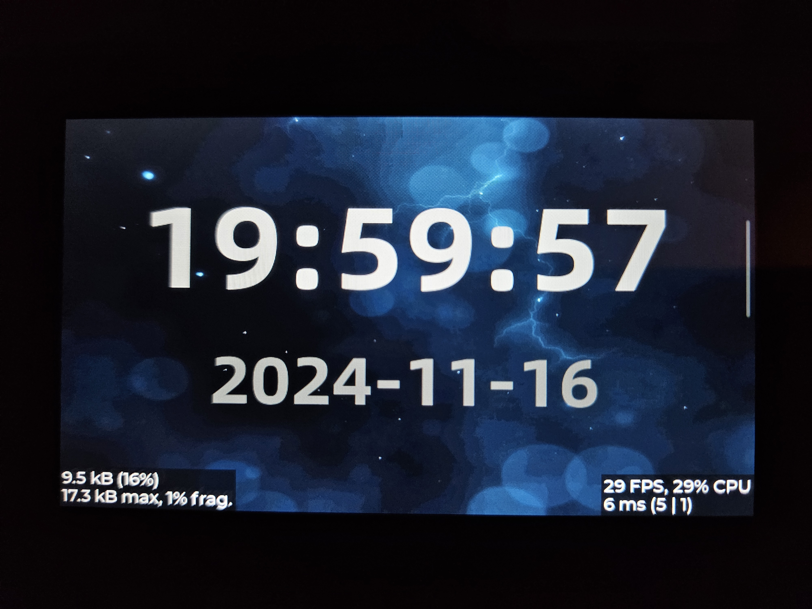

# Waveshare Esp32-s3-touch-lcd-4.3b

Este repositorio pretende ser un estudio/juego de la librería [LVGL](https://lvgl.io) con el framework Arduino en un [esp32-s3-touch-lcd-4.3b](https://www.waveshare.com/esp32-s3-touch-lcd-4.3b.htm) en proyectos WiFi.  

Casi toda la información la saco de este gran blog [randomnerdtutorials](https://randomnerdtutorials.com) y adapto los proyectos a mi gusto. 

## Ejemplo 1 - Reloj Digital con Tiempo y Fecha

Se trata de mi version de un reloj digital que se muestra en este [tutorial](https://randomnerdtutorials.com/esp32-cyd-lvgl-digital-clock/) 

Un reloj digital que muestra la hora y la fecha mediante LVGL (Light Versatile Graphics Library). Es una excelente manera de aprender sobre interfaces gráficas y conectividad IoT. Usaremos WorldTimeAPI para obtener la hora y la fecha actuales. 

Usaré PlatformIO para realizar los ejempos en el ESP32S3.

### Pasos 

- ~~[x] Crear el template de la interfaz de usuario con dos pantallas que se intercambian con el gesto del desplazamiento del dedo a derecha e izquierda.~~
- [x] Usar tileview en vez de lo anterior para el desplazamiento entre pantallas
- [x] Pantalla WiFi para conectarse al WiFi en un inicio y mostrar el estado de la conexión después.
- [x] La información de la conexión, SSID y Password, debe de almacenarse permaentemente y si es posible conectarse automáticamente al router WiFi  
- [x] Pantalla reloj en donde se mostrará Hora y Fecha 

